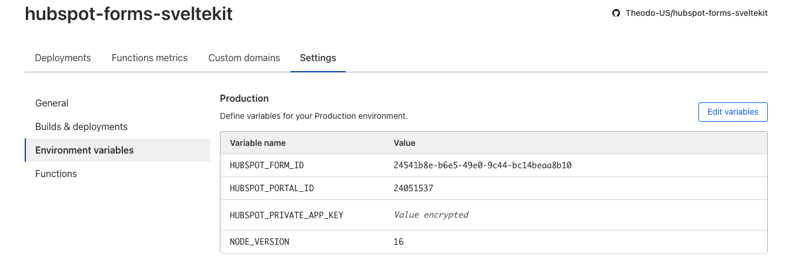

# HubSpot Forms and CloudFlare Pages

This repository is a sample repository used for demonstration and testing purposes for this [article](https://blog.theodo.com/2023/04/hubspot-forms-with-cloudflare/).

## Setup

There are two folders in this repository. The `svelte-form` folder contains all of the code for the form running on Cloudflare Pages. The `performance-test` folder contains all of the tests used to do load testing on both the hubspot article and the cloudflare site.

### Svelte Form

Navigate to the `svelte-form` folder

If you followed the setup steps in the article linked above you will have a private app. This will be necessary moving forward.

Create a copy of the `.env.template` file and name it `.env`. There are three values needed to make the connection with the hubspot api work: your private app key, the form id, and the portal id. Paste these values into the appropriate variables. 

From here you can run proceed like normal

```
npm install
```
```
npm run dev
```

And you will have a local copy of the form running!

To get the form hosted on cloudflare follow the setup section of the article.
You will then need to make sure Cloudflare knows the hubspot values as well add them to the settings section of your app on cloudflare:



If you followed everything correctly the next time you push to main your hubspot site should trigger a deployment!

### Performance Tests

Navigate to the `performance-test` folder

To run these tests on the Theodo managed forms you simply need to run a few commands.

```
npm install
```
```
npm run gen:cloudflare
```
This command will generate a new folder named `reports` in it you will find json and html reports on the results of the test against the cloudflare page.

```
npm run gen:hubspot
```

This command will add the hubspot version of the test results to the same `reports` folder.

If you would like to run these tests on different sites you may need to regenerate the tests using [Playwright codegen](https://playwright.dev/docs/codegen) to make sure you hit all of the form fields you want.

Make any necessary updates to the tests in the `cloudflare/flows` and `hubspot/flows` folder 

Lastly you will want to update the target in each of the test definitions to be the version of the cloudflare form / hubspot form you have deployed:

```YAML
config:
  target: 'https://hubspot-forms-sveltekit.pages.dev'
  phases:
    - duration: 30
      arrivalRate: 5
      name: Medium burst load
  engines:
    playwright: { aggregateByName: true }
  processor: flows/cloudflare-load-test.js
scenarios:
  - name: 'Cloudflare form submission medium load'
    engine: playwright
    flowFunction: 'formSubmissionTest'
    flow: []
```

### Contacts:

If you have any questions or inquiries please reach out to:

nated@theodo.com

kylek@theodo.com

jrb@thoeod.com